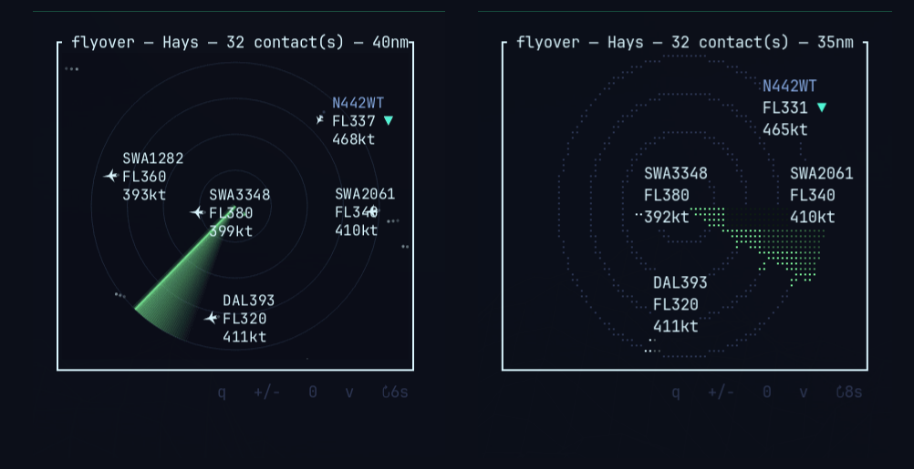
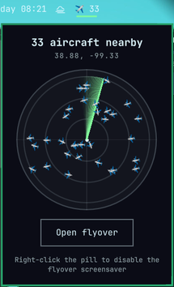

# flyover

[](https://github.com/linuxbren/flyover/actions/workflows/ci.yml)
[](https://crates.io/crates/flyover)
[](LICENSE)
[](CHANGELOG.md)

A real-time ADS-B radar scope, in your terminal.



`flyover` pulls live aircraft positions from [adsb.lol](https://adsb.lol) for
wherever you are and renders them as an old-school radar scope — range rings,
a rotating sweep, fading comet trails, and per-contact data tags (callsign,
altitude, groundspeed, climb/descend). Built for [Omarchy](https://omarchy.org)
specifically: it reads your live Omarchy theme colors so the scope always
matches whatever theme you're running, and ships with an optional bar widget
that shows an ambient aircraft count and launches the scope on click.

## Two render modes

- **Sixel** (default) — an off-screen rasterizer (anti-aliased circles/lines,
  soft phosphor glow) displayed via the Sixel graphics protocol. Real CRT
  look, but per-frame cost depends heavily on your terminal's own Sixel
  decoder — some terminals render this buttery smooth, others less so.
- **Braille** — the original character-based renderer (no image encoding at
  all), animates smoothly everywhere, more of a classic "ASCII radar" look.

Press `v` any time to switch between them.

## Airport & airspace overlays (Sixel only)

The Sixel scope also draws real nearby airport infrastructure as a dim
backdrop, so you can see traffic in context rather than floating in a void:

- **Runway silhouettes** — real, oriented runway geometry for nearby
  airports, sourced from [OurAirports](https://ourairports.com/). Dims
  with distance from center and disappears past the outer range ring, so
  it never competes with live traffic.
- **Class B airspace boundaries** — the outer lateral boundary of any
  nearby Class B airspace, sourced live from the FAA's own airspace data.

To keep this readable, only *towered* airports get a silhouette — Class
B/C nationwide, plus any Class D/E field within 10nm of your configured
location (so your own home airport shows up even if it's a small one).
Both datasets are cached locally (`~/.cache/flyover/`) and refreshed
roughly monthly, not fetched on every launch.

Braille mode doesn't render either of these — it stays a pure
character-based renderer by design.

## Requirements

- A Rust toolchain (to build)
- A terminal that supports Sixel graphics for the default mode (confirmed
  working in [foot](https://codeberg.org/dnkl/foot); braille mode works in
  any terminal regardless)
- Best experience on [Omarchy](https://omarchy.org) — live theme sync and the
  bar widget are Omarchy-specific. The scope itself still runs anywhere with
  a fontconfig `monospace` alias (falls back to a classic CRT-green palette
  off Omarchy) and a set location (see below).

## Install

The pill (see below) checks `PATH` first, so `cargo install` is the
easiest way to get set up:

```
cargo install flyover
```

### Arch / Omarchy (PKGBUILD)

Not on the AUR yet, but the PKGBUILD it'll eventually use is already
here and verified — clone and build it directly with `makepkg`:

```
git clone https://github.com/linuxbren/flyover.git
cd flyover/packaging/aur
makepkg -si
```

This builds from source and installs like any other Arch package
(binary, license, and man-adjacent docs under `/usr`), no `cargo`
install step needed afterward.

## Build from source

```
git clone https://github.com/linuxbren/flyover.git
cd flyover
cargo build --release
```

Always use `--release`. Sixel encoding is real per-frame work; a debug build
is noticeably choppier (the app warns about this on startup if it detects one).

## Location

flyover reads its center point from
`~/.local/state/omarchy/settings/weather.json` (the same file Omarchy's
Weather widget uses), so if you've already set a weather location you're set:

```
omarchy-weather-location --set "Your City" <lat,lon>
```

Without Omarchy installed, create that file by hand with
`{"name": "...", "latitude": ..., "longitude": ...}`.

## Run

```
cargo run --release
```

| Key | Action |
|---|---|
| `q` / `Esc` | quit |
| `+` / `-` / arrow up/down | zoom in/out (5–100nm) |
| `0` | reset zoom |
| `v` | toggle Sixel / braille render mode |

## Bar widget (Omarchy)



A companion widget — an ambient aircraft-count pill for the bar that
launches (or focuses) the scope on click — lives in its own repo,
[flyover-pill](https://github.com/linuxbren/flyover-pill), so it installs the
normal Omarchy way:

```
omarchy plugin add https://github.com/linuxbren/flyover-pill.git --enable
omarchy bar put bren.flyover --section right
```

It resolves the `flyover` binary via `PATH` first, falling back to a few
well-known install locations — so it works whether you've `cargo
install`ed it, built it in place, or installed it from the AUR.
Left-click opens a docked popup with its own live mini radar and a
button to launch the full scope; right-click toggles the
[screensaver](#screensaver-experimental) on/off (see below) once you've
set that up.

## Screensaver (experimental)

`flyover --screensaver` runs the same live scope as the interactive TUI —
sweep, fading trails, theme sync — exiting on its own on any keypress or
loss of focus. See [`packaging/screensaver/`](packaging/screensaver/) for a
patch to Omarchy's own screensaver script that launches it in place of
running static branding text through `ttfx`'s random effects.

It defaults to whichever render mode (Sixel or Braille) you last set with
`v` in the interactive TUI — the screensaver mirrors that setting rather
than always forcing Sixel. `--screensaver --sixel` / `--screensaver --ascii`
override that for one-off testing without changing the saved setting.

Omarchy has no pluggable "choose a screensaver" list, so instead of a
separate toggle command, enabling/disabling this repurposes Omarchy's own
`omarchy branding screensaver text|reset` (normally "edit branding text" /
"reset to default") — see [`packaging/screensaver/README.md`](packaging/screensaver/README.md#menu-integration-optional)
for the one-time setup. Once that's done, the bar widget's right-click
(above) is the easiest way to flip it.

## Dev tools

- `flyover --preview <path>.png` — renders a synthetic scene straight to a
  PNG, bypassing the terminal and network entirely. Useful for checking the
  raster output without a live TTY.
- `flyover --bench` — times the raster + Sixel-encode pipeline (both render
  modes) against an in-memory backend, to diagnose per-frame cost.

## Changelog

See [CHANGELOG.md](CHANGELOG.md).

## License

MIT — see [LICENSE](LICENSE).
